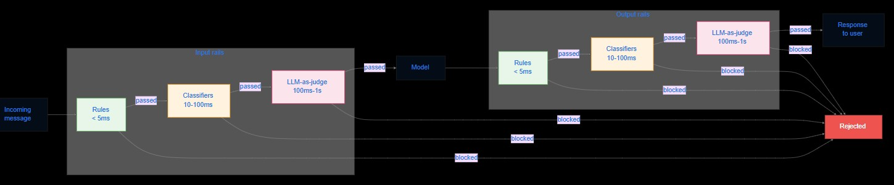

# AI in Production

- Jumping Rivers

- <https://ai-in-production.jumpingrivers.com/>

- Theme?

- Rethink

## 

{fig-alt="I am an AI brontosaurus"}

# Async Agents in Production: Failure Modes and Fixes

## 

<iframe src="https://metr.org/time-horizons/" width="100%" height="500px" title="AI time horizons">

</iframe>

## 

- AI writes code, and submits PRs

- AI reviews PR and adds to code base

# Certara CODEX

##

<https://www.certara.com/codex-clinical-trial-outcomes-databases/>

- AI Native Development

- The challenge ceases to be *generating* code and becomes *governing* code

- No code without a **contract**

##  {auto-animate="true"}

Agent 1 - Code

##  {auto-animate="true"}

Agent 2 - Tests

Agent 1 - Code

##  {auto-animate="true"}

This lifts the coder from reviewer to a higher level

Agent 2 - Tests

Agent 1 - Code

## MCP, or not MCP

- A specification for providing tools to LLMs

- MCP (Model Context Protocol) is available on Posit infra

- Can be local or remote

- Authenticate APIs without credentials

## 

- MCP is an API standard (it sends json and gets json back)

<https://simonwillison.net/2025/Jun/16/the-lethal-trifecta/>

<https://enpiar.com/mcp-newcastle-2026/#/title-slide>

<https://www.researchgate.net/publication/397780605_Adversarial_Poetry_as_a_Universal_Single-Turn_Jailbreak_Mechanism_in_Large_Language_Models>

# Agentic AI and the Future of Software Development

## 

::::: columns
::: {.column width="50%"}
- Prompt engineering

- Context engineering

- Harness engineering
:::

::: {.column width="50%"}

:::
:::::

Code costs tend to zero, but it's hard and needs specific conditions

Need new processes and practices that are built around the strengths and weaknesses of AI, rather than human strengths and weaknesses.

## A manifesto

- Shape systems, don't write code

- Product thinking over delivery thinking

- Validating outcomes over reviewing code

- Fast feedback over upfront certainty

- Breadth of perspective over narrow specialism

- Empowered individuals over standardised process

- Continuous transformation over one-time change

# Open Source Guardrails for AI

##

<https://m-misiura.github.io/ai-in-production-conference/#/open-source-guardrails-for-ai-securing-llm-applications-at-scale>

- Rules (regex, keywords)

- Classifiers

- LLM-as-judge

##

- [NeMo](https://www.nvidia.com/en-gb/ai-data-science/products/nemo/)

- [EvalHub](https://github.com/eval-hub)

- Automated red teaming

- Guardrails as a service

# Some Examples

## 

- [Machine Learning to Predict Inland Water Quality](https://www.waterqualitylive.info/)

- [Comparing and Evaluating Large Language Models for Efficient and Responsible Data Rescue](https://ijdc.net/index.php/ijdc/article/view/1027)

- [Wordnerds](https://en.wikipedia.org/wiki/BigQuery)

- Energy impact estimate in watt hours (tokens*energy)

- [Posit Assistant](https://positron.posit.co/assistant.html)

## The Bitter Lesson

<http://www.incompleteideas.net/IncIdeas/BitterLesson.html>

- Brute force beats leveraging human understanding

#

{fig-alt="Fin"}

